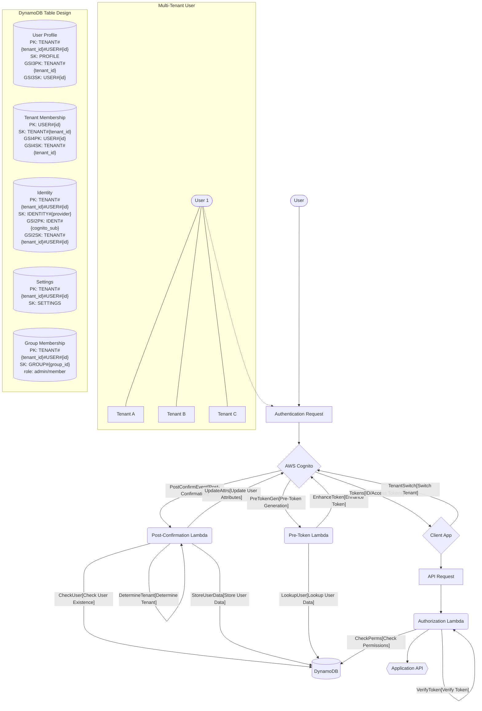

# Terraform AWS Auth Module

A secure, scalable authentication and identity management module for AWS Cognito using best practices and Single Table Design - now with **multi-tenant support** and **users in multiple tenants**.

## Overview

This module provides a complete authentication system that solves common Cognito implementation challenges, particularly the "don't use Cognito sub as user ID" problem. It creates:

1. A Cognito User Pool with secure configuration
2. Lambda triggers to handle user identity management
3. A DynamoDB table with Single Table Design for flexible identity storage
4. Support for multiple login methods per user (email, social providers)
5. Secure token generation with consistent user identification
6. **Multi-tenant isolation of user data and identities**
7. **Support for users belonging to multiple tenants**

## Why This Module?

This module addresses several critical problems with standard Cognito implementations:

1. **Cognito Sub Limitations**: Using Cognito's `sub` as your primary user identifier creates problems with identity federation and user pool migrations. This module implements a custom user ID system.

2. **Multiple Identity Methods**: Users often want to log in with email and social providers. This module supports linking multiple login methods to the same user account.

3. **Token Enrichment**: Standard Cognito tokens lack business context. This module adds custom claims for improved authorization.

4. **Consistent Identity**: Applications need a stable user identifier regardless of authentication method. This module provides that through custom IDs and token enhancement.

5. **Multi-Tenant Support**: Enterprise applications often need to support multiple organizations on the same infrastructure. This module implements secure multi-tenant isolation.

6. **Users in Multiple Tenants**: Users can belong to multiple organizations, with proper tenant context and switching functionality.

## Architecture



The module implements:

### 1. Single Table Design for Identity Management with Multi-Tenant Support

Uses one DynamoDB table with composite keys and GSIs to efficiently model:
- Tenant boundaries
- User profiles
- Multiple login methods per user
- Flexible metadata storage
- User membership in multiple tenants
- Group memberships and roles

Access patterns supported:
- Get user by ID within a tenant
- Find user by email via Cognito
- Find user by Cognito sub (with tenant context)
- Get all tenants a user belongs to
- Get all users within a tenant
- Get all groups a user belongs to in a tenant

### 2. UUIDv7 for Sortable User IDs

Generates time-sortable UUIDv7 identifiers that:
- Maintain uniqueness across distributed systems
- Allow chronological sorting of users
- Improve database performance through temporal locality
- Enable more efficient range queries

### 3. Lambda Triggers for Identity Processing

Three critical Lambda functions:

**Pre-Signup Lambda**
- Optional verification and tenant determination
- Can be used to enforce tenant-specific signup rules

**Post-Confirmation Lambda**
- Handles user signup and identity linking
- Determines tenant context
- Generates custom user IDs (UUIDv7)
- Creates tenant-specific database records
- Creates tenant membership records for multi-tenant users
- Uses transactions for data consistency

**Pre-Token Generation Lambda**
- Enhances tokens with consistent user identifier and tenant ID
- Adds business-specific claims for improved authorization
- Detects users who belong to multiple tenants
- Adds multi-tenant flags to tokens
- Ensures token validity across authentication methods
- Improves performance of downstream services

## Multi-Tenant Implementation

This module uses a **Pool-Based Multi-Tenancy with Session-Based Tenant Context** approach, where:

- All tenants share a single Cognito User Pool
- All data is stored in a single DynamoDB table
- Tenant isolation happens at the data level through key prefixes
- Tokens include tenant context for authorization
- Users can belong to multiple tenants
- Each authentication session operates in a single tenant context
- Applications can implement tenant switching using the token refresh flow

## Registration Controls

The module provides options to control user registration:

### 1. Admin-Only User Creation

Completely disable self-signup and only allow administrators to create users:

```hcl
module "auth" {
  source = "github.com/burib/terraform-aws-auth-module"
  
  domain_name = "myapp.example.com"
  
  # Only allow admin to create users
  only_admin_can_create_users = true
}
```

When enabled, users cannot register themselves through the UI or API. Instead, administrators must create user accounts through the AWS Console or API, and users receive an email with temporary credentials.

### 2. Domain Restrictions

Restrict registration to users with specific email domains:

```hcl
module "auth" {
  source = "github.com/burib/terraform-aws-auth-module"
  
  domain_name = "myapp.example.com"
  
  # Only allow registrations from these domains
  allowed_domains = ["acme-corp.com", "partner.org"]
}
```

If the `allowed_domains` list is empty, all email domains are allowed to register.

### 3. Tenant Determination Strategy

The module supports different strategies for determining which tenant a user belongs to during registration:

```hcl
module "auth" {
  source = "github.com/burib/terraform-aws-auth-module"
  
  domain_name = "myapp.example.com"
  
  # Domain-based tenant strategy
  tenant_strategy = "domain"
  domain_tenant_map = {
    "acme-corp.com" = "acme"
  }
  require_tenant = true
}
```

See the [Tenant Determination Documentation](#tenant-determination-documentation) section for more details.

### Data Separation Between Cognito and Application

This module maintains a clean separation of concerns:

1. **Cognito** stores:
   - Email addresses and contact information
   - Authentication credentials (passwords)
   - Basic user identity attributes
   - Verification status
   - Phone numbers and other contact methods

2. **DynamoDB** stores:
   - Tenant membership information
   - User ID to tenant mappings
   - Roles and permissions
   - Application-specific user metadata
   - Group memberships

This separation ensures email addresses and sensitive user information are only stored in Cognito, not duplicated across your application databases.

### Data Isolation

Tenant isolation is implemented through DynamoDB key design:

```
// User in Tenant A
PK: TENANT#tenant-a#USER#01HGXYZ123A...
SK: PROFILE

// Same User in Tenant B
PK: TENANT#tenant-b#USER#01HGXYZ123A...
SK: PROFILE

// User's Tenant Memberships
PK: USER#01HGXYZ123A...
SK: TENANT#tenant-a

PK: USER#01HGXYZ123A...
SK: TENANT#tenant-b
```

This ensures that queries within one tenant cannot access data from another tenant.

### Token Structure

The module adds tenant context to JWT tokens, along with multi-tenant user information:

```json
{
  "sub": "cognito-sub-value",
  "user_id": "01HGXYZ123ABCDEFGHJKLMNOPQ",
  "tenant_id": "tenant-a",
  "role": "admin",
  "email": "user@example.com",
  "has_multiple_tenants": "true",
  "tenant_count": "3"
}
```

This lets applications detect users who belong to multiple tenants and offer tenant switching.

## Application Implementation for Tenant Switching

While the authentication module provides the foundation for multi-tenant users, your application needs to implement the tenant switching UI and logic. Here's how:

### 1. Detect Multi-Tenant Users

Check for the `has_multiple_tenants` claim in the token:

```javascript
// React example
const { user_id, tenant_id, has_multiple_tenants } = useAuth().user;

useEffect(() => {
  if (has_multiple_tenants === 'true') {
    // Show tenant selector in UI
    fetchUserTenants(user_id);
  }
}, [has_multiple_tenants, user_id]);
```

### 2. Fetch Available Tenants

Query DynamoDB for all tenants the user belongs to:

```javascript
// Server-side API endpoint (Node.js example)
async function getUserTenants(userId) {
  const params = {
    TableName: process.env.USERS_TABLE_NAME,
    KeyConditionExpression: 'PK = :userId AND begins_with(SK, :tenantPrefix)',
    ExpressionAttributeValues: {
      ':userId': `USER#${userId}`,
      ':tenantPrefix': 'TENANT#'
    }
  };
  
  const result = await dynamoDB.query(params).promise();
  
  return result.Items.map(item => {
    const tenantId = item.SK.replace('TENANT#', '');
    return {
      id: tenantId,
      role: item.role || 'member',
      status: item.status
    };
  });
}
```

### 3. Implement Tenant Switching

When a user selects a different tenant, refresh the tokens with the new tenant context:

```javascript
// Client-side tenant switching (React example)
async function switchTenant(newTenantId) {
  try {
    // 1. Call your backend API that handles the token refresh
    const response = await fetch('/api/auth/switch-tenant', {
      method: 'POST',
      headers: { 'Content-Type': 'application/json' },
      body: JSON.stringify({ tenantId: newTenantId })
    });
    
    const { idToken, accessToken, refreshToken } = await response.json();
    
    // 2. Update your auth context/store with new tokens
    updateAuthTokens(idToken, accessToken, refreshToken);
    
    // 3. Update UI to reflect new tenant context
    setActiveTenant(newTenantId);
    
    // 4. Reload relevant data for the new tenant
    await loadTenantData(newTenantId);
    
  } catch (error) {
    console.error('Failed to switch tenant:', error);
  }
}
```

### 4. Server-Side Tenant Switching Endpoint

```javascript
// Server-side tenant switching endpoint (Node.js example)
app.post('/api/auth/switch-tenant', async (req, res) => {
  const { user_id } = req.user; // From your auth middleware
  const { tenantId } = req.body;
  
  try {
    // 1. Verify user belongs to this tenant
    const membershipResult = await dynamoDB.get({
      TableName: process.env.USERS_TABLE_NAME,
      Key: {
        'PK': `USER#${user_id}`,
        'SK': `TENANT#${tenantId}`
      }
    }).promise();
    
    if (!membershipResult.Item) {
      return res.status(403).json({ error: 'User does not belong to this tenant' });
    }
    
    // 2. Get refresh token from secure cookie or request
    const refreshToken = req.cookies.refreshToken;
    
    // 3. Call Cognito token endpoint to get new tokens
    const tokenResponse = await fetch(`${cognito_token_endpoint}`, {
      method: 'POST',
      headers: { 'Content-Type': 'application/x-www-form-urlencoded' },
      body: new URLSearchParams({
        grant_type: 'refresh_token',
        client_id: process.env.COGNITO_CLIENT_ID,
        refresh_token: refreshToken,
        scope: `openid email profile custom:user_id custom:tenant_id`
      })
    });
    
    const tokens = await tokenResponse.json();
    
    // 4. Update Cognito user attributes with new tenant context
    await cognitoProvider.adminUpdateUserAttributes({
      UserPoolId: process.env.COGNITO_USER_POOL_ID,
      Username: req.user.sub,
      UserAttributes: [
        {
          Name: 'custom:tenant_id',
          Value: tenantId
        }
      ]
    }).promise();
    
    // 5. Return new tokens to client
    return res.json({
      idToken: tokens.id_token,
      accessToken: tokens.access_token,
      refreshToken: tokens.refresh_token || refreshToken // Keep existing if not returned
    });
    
  } catch (error) {
    console.error('Tenant switch error:', error);
    return res.status(500).json({ error: 'Failed to switch tenant' });
  }
});
```

## Usage

```hcl
module "auth" {
  source = "github.com/burib/terraform-aws-auth-module"
  
  domain_name = "myapp.example.com"
  environment = "production"
  
  # Password policy
  password_policy = {
    minimum_length                   = 8
    require_lowercase                = true
    require_numbers                  = true
    require_symbols                  = true
    require_uppercase                = true
    temporary_password_validity_days = 7
  }
  
  # Multi-tenant configuration
  tenant_strategy = "domain"
  domain_tenant_map = {
    "acme-corp.com" = "acme"
  }
  allow_personal_tenants = true
  
  # Registration controls
  only_admin_can_create_users = false  # Allow self-registration
  allowed_domains = ["acme-corp.com", "partner.org"]  # Restrict domains
  
  tags = {
    Environment = "production"
    Project     = "MyApp"
  }
}
```

## Implementing Authorization

This module provides authentication and identity management but delegates authorization to your API Gateway stack. A sample authorization Lambda is provided as a reference.

To implement authorization:

1. Create an authorization Lambda in your API Gateway stack
2. Configure it as a custom authorizer for API Gateway
3. Use the sample code provided as a starting point

The authorization Lambda should:
- Validate the JWT token from Cognito
- Extract user_id and tenant_id from the token
- Check if the user has permission to access the resource
- Return an IAM policy document allowing or denying access

Example authorization Lambda structure:

```python
def lambda_handler(event, context):
    # Get token from Authorization header
    token = event['authorizationToken'].replace('Bearer ', '')
    
    # Verify token and extract claims
    claims = verify_token(token)
    
    # Extract tenant and user context
    tenant_id = claims.get('tenant_id')
    user_id = claims.get('user_id')
    
    # Check permissions (implement your logic here)
    has_permission = check_permission(tenant_id, user_id, event['methodArn'])
    
    # Generate policy
    effect = 'Allow' if has_permission else 'Deny'
    return generate_policy(user_id, effect, event['methodArn'], {
        'tenant_id': tenant_id
    })
```

## Inputs

| Name | Description | Type | Default | Required |
|------|-------------|------|---------|----------|
| domain_name | Domain name used for Cognito and resource naming | `string` | n/a | yes |
| environment | Environment (dev, staging, prod) | `string` | n/a | yes |
| password_policy | Cognito password policy configuration | `object` | See variables.tf | no |
| tenant_strategy | Strategy for determining tenant ID: 'domain', 'invitation', 'personal', 'strict' | `string` | `"domain"` | no |
| allow_personal_tenants | Whether to allow creation of personal tenants if no organizational tenant | `bool` | `true` | no |
| domain_tenant_map | Mapping of email domains to tenant IDs | `map(string)` | `{}` | no |
| allowed_domains | List of allowed email domains for registration. If empty, all domains are allowed. | `list(string)` | `[]` | no |
| require_tenant | Whether to require valid tenant ID during registration | `bool` | `false` | no |
| only_admin_can_create_users | Whether to restrict user creation to administrators only | `bool` | `false` | no |
| invitation_table_name | Name of existing DynamoDB table for invitations (empty = create new) | `string` | `""` | no |
| invitation_expiry_days | Number of days before invitation codes expire | `number` | `7` | no |
| tags | Tags to apply to resources | `map(string)` | `{}` | no |

## Outputs

| Name | Description |
|------|-------------|
| cognito_user_pool_id | ID of the Cognito User Pool |
| cognito_user_pool_client_id | ID of the Cognito User Pool Client |
| cognito_identity_pool_id | ID of the Cognito Identity Pool |
| users_table_name | Name of the DynamoDB Users table |
| users_table_arn | ARN of the DynamoDB Users table |
| token_endpoint | OAuth2 token endpoint for token refresh/tenant switching |
| revoke_token_endpoint | OAuth2 token revocation endpoint |

## Tenant Determination Documentation

### Available Strategies

#### 1. Domain-Based Tenant Mapping (`domain`)

Uses the email domain to determine tenant association. This is useful for corporate environments where email domains naturally map to organizations.

```hcl
module "auth" {
  source = "github.com/burib/terraform-aws-auth-module"
  
  domain_name = "myapp.example.com"
  
  # Domain-based tenant strategy
  tenant_strategy = "domain"
  domain_tenant_map = {
    "acme-corp.com"  = "acme"
    "subsidiary.com" = "acme"       # Map subsidiary to parent
    "partner.com"    = "partner-org"
  }
  
  # Optional: restrict to only allowed domains
  allowed_domains = ["acme-corp.com", "subsidiary.com", "partner.com"]
}
```

If a user registers with `john@acme-corp.com`, they will be assigned to the `acme` tenant.

#### 2. Invitation-Based Tenant Assignment (`invitation`)

Uses invitation codes to determine tenant context during signup. This provides control over tenant membership.

```hcl
module "auth" {
  source = "github.com/burib/terraform-aws-auth-module"
  
  domain_name = "myapp.example.com"
  
  # Invitation-based tenant strategy
  tenant_strategy = "invitation"
  require_tenant  = true  # Registration fails if no tenant context provided
}
```

Invitation codes can include tenant information in the format `TENANT:CODE`.

#### 3. Personal Tenant Creation (`personal`)

Creates a unique tenant for each user, ideal for consumer applications or when users start without organizational affiliation.

```hcl
module "auth" {
  source = "github.com/burib/terraform-aws-auth-module"
  
  domain_name = "myapp.example.com"
  
  # Personal tenant strategy
  tenant_strategy = "personal"
}
```

This creates a tenant ID like `personal-a1b2c3d4` for each user. The user is automatically made an admin of their personal tenant.

#### 4. Strict Tenant Assignment (`strict`)

Requires explicit tenant determination through allowed domains, invitation, or client metadata. Registration fails if a tenant cannot be determined.

```hcl
module "auth" {
  source = "github.com/burib/terraform-aws-auth-module"
  
  domain_name = "myapp.example.com"
  
  # Strict tenant strategy
  tenant_strategy = "strict"
  require_tenant  = true
  allow_personal_tenants = false
}
```

### Security Considerations

#### Avoiding the "Default" Tenant Problem

This module avoids using a generic "default" tenant, which could cause unrelated users to share data. Instead, it provides these more secure alternatives:

1. **Personal Tenants**: Each user gets their own isolated tenant
2. **Invitation Codes**: Users can join tenants through invitation codes
3. **Domain Validation**: Only users with approved email domains can register
4. **Strict Mode**: Registration fails if tenant cannot be determined

#### Preventing Tenant Data Leakage

To ensure strong tenant isolation:

1. **Configure Proper Tenant Strategy**: Choose a strategy that aligns with your security model
2. **Set `require_tenant = true`**: For sensitive applications to prevent users without tenant context
3. **Use Domain Mapping**: For B2B applications to automatically assign users to their company
4. **Implement Authorization**: Always validate tenant access in your APIs

## Multi-Tenant Best Practices

When using this module for multi-tenant applications:

1. **Separation of Concerns**:
   - Keep email addresses and identity information in Cognito
   - Keep tenant relationships and application data in DynamoDB
   - Minimize duplication of sensitive user information

2. **Authorization Lambda**:
   - Implement the provided sample authorization Lambda in your API Gateway stack
   - Always validate tenant context in authorization checks
   - Verify user belongs to the tenant before allowing access

3. **Tenant Determination**:
   - Customize the `determine_tenant_id` function in the post-confirmation Lambda
   - Consider implementing tenant invitation flows for more controlled access

4. **UI/UX Considerations**:
   - Show clear tenant context indicators in your UI
   - Implement tenant switching in a dropdown or dedicated menu
   - Consider color coding or other visual cues for different tenants

5. **Security Boundaries**:
   - Always validate tenant_id in all APIs
   - Never allow cross-tenant data access
   - Don't expose tenant IDs in URLs or client-side code

6. **Tenant Switching Flow**:
   - Implement a secure tenant switching endpoint
   - Update tokens and Cognito attributes when switching
   - Consider clearing cache/state when changing tenants

7. **Testing**:
   - Test tenant isolation thoroughly
   - Verify that one tenant cannot access another tenant's data
   - Validate that authorization correctly enforces tenant boundaries
   - Test the tenant switching flow with multiple browsers/sessions

## References

This module implements best practices from:
- AWS Well-Architected Framework
- Yan Cui's recommendations on Cognito identity management
- DynamoDB Single Table Design patterns
- Serverless security best practices
- Multi-tenant SaaS architecture patterns