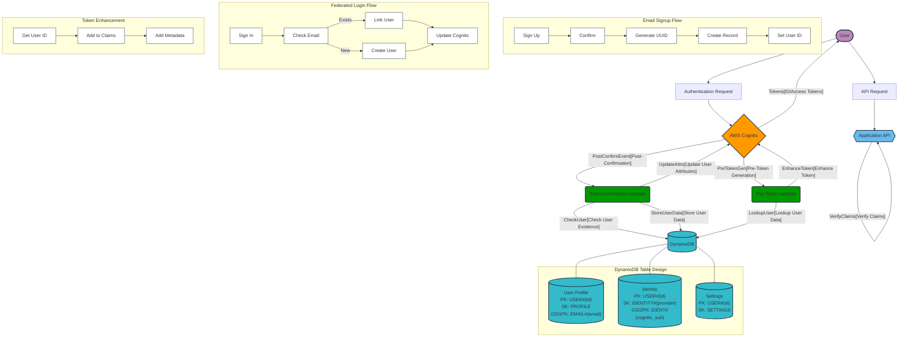

# Terraform AWS Auth Module

A secure, scalable authentication and identity management module for AWS Cognito using best practices and Single Table Design.

## Overview

This module provides a complete authentication system that solves common Cognito implementation challenges, particularly the "don't use Cognito sub as user ID" problem. It creates:

1. A Cognito User Pool with secure configuration
2. Lambda triggers to handle user identity management
3. A DynamoDB table with Single Table Design for flexible identity storage
4. Support for multiple login methods per user (email, social providers)
5. Secure token generation with consistent user identification

## Why This Module?

This module addresses several critical problems with standard Cognito implementations:

1. **Cognito Sub Limitations**: Using Cognito's `sub` as your primary user identifier creates problems with identity federation and user pool migrations. This module implements a custom user ID system.

2. **Multiple Identity Methods**: Users often want to log in with email and social providers. This module supports linking multiple login methods to the same user account.

3. **Token Enrichment**: Standard Cognito tokens lack business context. This module adds custom claims for improved authorization.

4. **Consistent Identity**: Applications need a stable user identifier regardless of authentication method. This module provides that through custom IDs and token enhancement.

## Architecture



The module implements:

### 1. Single Table Design for Identity Management

Uses one DynamoDB table with composite keys and GSIs to efficiently model:
- User profiles
- Multiple login methods per user
- Flexible metadata storage
- Efficient lookup patterns

Access patterns supported:
- Get user by ID
- Find user by email
- Find user by Cognito sub
- Get all identities for a user
- Get user settings/preferences

### 2. UUIDv7 for Sortable User IDs

Generates time-sortable UUIDv7 identifiers that:
- Maintain uniqueness across distributed systems
- Allow chronological sorting of users
- Improve database performance through temporal locality
- Enable more efficient range queries

### 3. Lambda Triggers for Identity Processing

Two critical Lambda functions:

**Post-Confirmation Lambda**
- Handles user signup and identity linking
- Generates custom user IDs (UUIDv7)
- Detects and links multiple login methods for the same user
- Uses transactions for data consistency

**Pre-Token Generation Lambda**
- Enhances tokens with consistent user identifier
- Adds business-specific claims for improved authorization
- Ensures token validity across authentication methods
- Improves performance of downstream services

## User Flows

The module handles these key authentication flows:

### 1. New User Signup
- User signs up with email/password
- Cognito confirms the user
- Lambda generates UUIDv7 user ID
- Lambda creates user record in DynamoDB
- User receives a token with their user ID

### 2. Federated Login (First Time)
- User signs in with social provider (Google, etc.)
- Lambda checks if email exists
- If new user: creates new user profile with new ID
- If existing user: links identity to existing user
- User receives token with consistent user ID

### 3. Multiple Login Methods
- User who signed up with email later uses Google
- System recognizes same email
- Links both authentication methods to same user ID
- User sees the same account regardless of login method

## Technical Implementation

### DynamoDB Data Model

The module implements a Single Table Design with these key structures:

**User Profile**
```
PK: USER#{id}
SK: PROFILE
email: user@example.com
...
GSI1PK: EMAIL#{email}
GSI1SK: USER#{id}
```

**Identity Link**
```
PK: USER#{id}
SK: IDENTITY#{provider}
providerSub: {cognito-sub}
...
GSI2PK: IDENT#{cognito-sub}
GSI2SK: USER#{id}
```

**User Settings**
```
PK: USER#{id}
SK: SETTINGS
preferences: {...}
```

### Query Patterns

The module supports these essential queries:

1. **Email Lookup for Identity Linking**
```python
users_table.query(
    IndexName="GSI1",
    KeyConditionExpression="GSI1PK = :email",
    ExpressionAttributeValues={
        ":email": f"EMAIL#{email}"
    }
)
```

2. **Cognito Sub to User ID Lookup**
```python
users_table.query(
    IndexName="GSI2",
    KeyConditionExpression="GSI2PK = :id",
    ExpressionAttributeValues={
        ":id": f"IDENT#{cognito_sub}"
    }
)
```

3. **Direct User Data Access**
```python
users_table.get_item(
    Key={
        'PK': f"USER#{user_id}",
        'SK': "PROFILE"
    }
)
```

## Usage

```hcl
module "auth" {
  source = "github.com/burib/terraform-aws-auth-module"
  
  domain_name = "myapp.example.com"
  
  password_policy = {
    minimum_length                   = 8
    require_lowercase                = true
    require_numbers                  = true
    require_symbols                  = true
    require_uppercase                = true
    temporary_password_validity_days = 7
  }
  
  tags = {
    Environment = "production"
    Project     = "MyApp"
  }
}
```

## Inputs

| Name | Description | Type | Default | Required |
|------|-------------|------|---------|----------|
| domain_name | Domain name used for Cognito and resource naming | `string` | n/a | yes |
| password_policy | Cognito password policy configuration | `object` | See variables.tf | no |
| tags | Tags to apply to resources | `map(string)` | `{}` | no |

## Outputs

| Name | Description |
|------|-------------|
| cognito_user_pool_id | ID of the Cognito User Pool |
| cognito_user_pool_client_id | ID of the Cognito User Pool Client |
| cognito_identity_pool_id | ID of the Cognito Identity Pool |
| users_table_name | Name of the DynamoDB Users table |
| users_table_arn | ARN of the DynamoDB Users table |

## Best Practices Implemented

1. **Security**
   - Cognito advanced security features enabled
   - Least privilege IAM policies
   - Encryption at rest for user data
   - Secure password policies
   - Protection against enumeration attacks

2. **Scalability**
   - Single Table Design for efficient access
   - DynamoDB On-Demand capacity mode
   - Efficient GSI design
   - Minimal cross-region dependencies

3. **Maintainability**
   - Consistent naming conventions
   - Comprehensive logging
   - Modular Lambda code
   - Clear separation of concerns
   - Well-documented user flows

## Multi-Region Considerations

While this module is deployed to a single region, it's designed to support multi-region architectures:

1. The custom user ID system makes user pool migrations possible
2. The DynamoDB table can be converted to a Global Table
3. The token generation Lambda works independently in each region
4. Route53 latency-based routing can direct users to the nearest Cognito endpoint

## References

This module implements best practices from:
- AWS Well-Architected Framework
- Yan Cui's recommendations on Cognito identity management
- DynamoDB Single Table Design patterns
- Serverless security best practices
